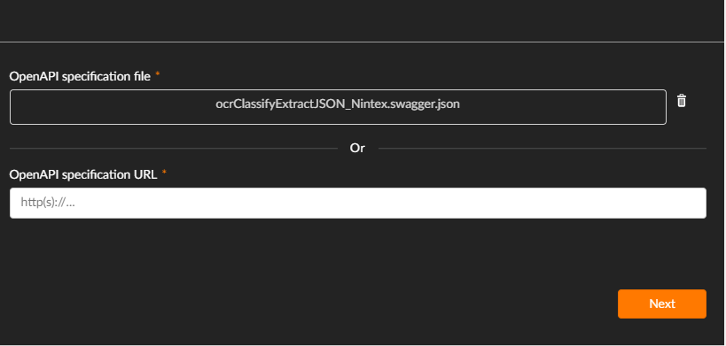
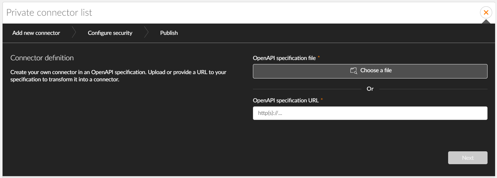
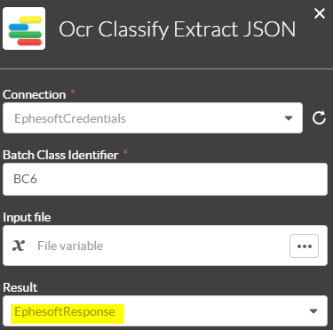

# Transact.Integration.NintexWorkflowCloud

This repository holds information on how to integrate Ephesoft Transact with Nintex Workflow Cloud (NWC). There are two primary ways to integrate Ephesoft and NWC: **Nintex Xtensions** and **External Start**.

## Table of Contents

- [Nintex Xtensions](#nintex-xtensions)
- [External Start](#external-start)

## Prerequisites

To take full advantage of this repository, you will need the following:
- A Nintex Workflow Cloud account

# Nintex Xtensions

This document provides an overview of how to integrate the `v2/ocrClassifyExtract` and `v2/ocrClassifyExtractBase64` web services with the Nintex workflow engine.

## Introduction

Nintex allows users to develop complex workflows that can integrate different products and services together, enabling decision-making processes with or without human intervention. 

**Example:** 
You can create a workflow to monitor Box and look for any new invoices created in a specific folder. 
1. When a new invoice is created in the **Incoming** folder, the `v2/ocrClassifyExtract` web service can extract the amount from the invoice and feed that data into a decision tree.
2. Invoices less than $1000 can be approved automatically and routed to the **Processed** folder in Box.
3. Invoices greater than $1000 can trigger a notification for an employee to review and approve the invoice before releasing it to the **Processed** folder.

**Note:** In the `v2/ocrClassifyExtract` and `v2/ocrClassifyExtractBase64` web services, there is no concept of separation. Transact performs classification based on the first page, which means each invoice should contain a single document of a single document type.

## XML vs JSON Web Services

Most Transact web services use XML for input and output. Conversely, the `v2/ocrClassifyExtract` and `v2/ocrClassifyExtractBase64` web services use simplified JSON for input and output.

 Following is an example of a simplified JSON response:

```json
{
    "Type": "Account_Cancellation",
    "Confidence": 59.21,
    "DocumentLevelField": [
    	{
            "Name": "Barcode",
            "Value": "CANCEL CODE 7220",
            "Confidence": 100,
            "OcrConfidenceThreshold": 10,
            "OcrConfidence": 9
    	},
    	{
            "Name": "AccountOwner",
            "Value": "Christopher Williams",
            "Confidence": 100,
            "OcrConfidenceThreshold": 90,
            "OcrConfidence": 93
     	},
     	{
            "Name": "AccountNumber",
            "Value": "004997",
            "Confidence": 100,
            "OcrConfidenceThreshold": 90,
            "OcrConfidence": 0
     	}, 
     	{
            "Name": "FirstName",
            "Value": "",
            "Confidence": 0,
            "OcrConfidenceThreshold": 90, 
            "OcrConfidence": 0
     	},
     	{
            "Name": "LastName",
            "Value": "",
            "Confidence": 0,
            "OcrConfidenceThreshold": 90, 
            "OcrConfidence": 0
     	}
     ]
}
```
As shown above, the JSON reply contains minimal data:

 - Document type name
 - Document type confidence
 - Index field names
 - Index field values
 - Index field confidence

## Using the ocrClassifyExtract Web Services 

With OpenAPI-compliant web services, uploading a JSON Swagger definition file into the workflow tool allows you to access the web services' capabilities almost immediately. Below is an example of how the Swagger definition can be used in the Nintex Workflow Cloud.


*Figure 1. Nintex Extension Configuration* 

Once the connector is automatically built, you can now use Ephesoft actions within the application designers as shown below.


*Figure 2. Nintex Designers with Ephesoft API Actions*

Through mid-process calls to add document intelligence to any process, incremental automation can take place, making workflows more intelligent and further reducing their requirement for human intervention.

## Creating a New Nintex Connector for Ephesoft Transact

Before you can create a Nintex workflow that takes advantage of Ephesoft Transact web services, you’ll need to create a new connector in the Nintex Xtensions framework using the appropriate Ephesoft Transact Swagger definition file.

To take full advantage of the sample workflow explained in this document, you will need a Nintex Workflow Cloud account.

### Create the Xtension Connector

1. Login to Nintex.
2. Click the **Xtensions** option in the left navigation.


*Figure 3. Create Workflow*

This will open the Nintex Xtensions page. Nintex Xtensions is a framework that allows you to create connectors to extend the Nintex Workflow Platform. 

3. Click the **+** icon in the top right corner to create a new connector.


*Figure 4. Private Connector List*

This will take you to the first step of a multi-step procedure to add your new connector.


*Figure 5. Connector Definition*

4. Click **Choose a file**.
5. Upload the updated **ephesoft.json** file. This is located in GitHub at [Nintex Xtensions](#Xtensions/ephesoft.json).


*Figure 6. OpenAPI Specification File*

6. Click **Next** to proceed to **Configure security**.


*Figure 7. Configure Security*

7. Accept the default value of **Basic Authentication**.
8. Click **Next** to proceed to **Publish**.
9. Accept the default values for **Name** and **Description**.
10. Click **Choose a file** and upload the Ephesoft logo. Download the logo in this repository at [Xtensions/EphesoftLogo](Xtensions/EphesoftLogo.png).


*Figure 8. Publish Settings*

11. Click **Publish**.

Your connector will appear in your Private connector list with a green triangle and check mark to indicate that it’s a new connector. The new connector is now available to you for building and editing workflows.

### Create a Workflow and Configure the Connection

Now that you’ve defined the Ephesoft Transact Xtension connector, you need to use that connector in a workflow . This connection will serve as a secure connection and the communication between Nintex Workflow Cloud and your Transact environment.

1. Click **Create a Workflow**.
2. Drag the **Upload Batch** action to the workflow canvas.


*Figure 9. Upload Batch*

Use the right panel to configure the connection.

3. In the **Connection Name**, enter the name of the connection that will be used to configure the workflow later on.
4. In the **Username** and **Password** fields, enter the login credentials for your Transact environment.

**Note:** You will need Developer rights.


*Figure 10. Transact Connection Details*

5. Click **Connect**. If the connection is successful, the following message will appear:


*Figure 11. Connection Created Notification*

## Nintex Workflow Overview

The following video showcases a workflow that will execute when files are dropped into a predefined location in Box. The files will be processed using the `v2/ocrClassifyExtract` web service, then a series of logical operations will take place to determine how different individuals should be notified of the results. 

This sample workflow is explained in the following video:
[Document Intelligence APIs for Nintex (YouTube)](https://www.youtube.com/watch?v=icaIuvvkD-0)

Send an email to [sales@ephesoft.com](mailto:sales@ephesoft.com) requesting the sample workflow, and we’ll reply with a workflow key that you can use to import this workflow into your own environment.

**Note:** Once the key is generated, you will have 72 hours to use the key and import the workflow into your environment. The workflow will continue to work after 72 hours, but the key will no longer be valid for new imports.

## Working with the Ephesoft JSON Responses
When consuming the Ephesoft extension, three fields are required. Below is an example of a completely configured extension.


*Figure 12. Extension Configuration*

* **Batch Class Identifier** — In the demo Ephesoft instance, this is BC6 for the Wealth Management demo.
* **Input File** — This file contains the document that will be examined by Ephesoft. Ingestion is usually completed by a previous start event (Box, SharePoint, Email). In the demo Ephesoft instance, this file was passed on by a **Box – New File** start event. The pointer to this file is the variable "File variable".
* **Results** — This is a Nintex text variable that will contain the JSON response from Ephesoft. In this example, the text variable is "EphesoftResponse". Adding a **Log to Instance Details** node directly after the Ephesoft extension will record the JSON response in the instance screen.


*Figure 13. Log to Instance Details Node*

To view the JSON response, navigate to the **Instances** screen and select your specific instance you would like to examine.


*Figure 14. Select Instance

### Example: Parse the JSON Response to Determine Document Type
Following is an example JSON response:
```json
{
	"Type": "Account_Cancellation",
	"Confidence": 59.21,
	"DocumentLevelField": [
		{
			"Name": "Barcode"
			"Value": "CANCEL CODE 7220"
			"Confidence": 100,
			"OcrConfidenceThreshold": 10,
			"OcrConfidence": 9
		},
		{
			"Name": "AccountOwner
			"Value": "Chrisopher Williams"
			"Confidence": 100,
			"OcrConfidenceThreshold": 90,
			"OcrConfidence": 93
		},
		{
			"Name": "AccountNumber"
			"Value": "004997
			"Confidence": 100,
			"OcrConfidenceThreshold": 90,
			"OcrConfidence": 100
		},
		{
			"Name": "FirstName"
			"Value": ""
			"Confidence": 0
			"OcrConfidenceThreshold": 90,
			"OcrConfidence": 0
		},
		{
			"Name": "LastName"
			"Value": ""
			"Confidence": 0,
			"OcrConfidenceThreshold": 90,
			"OcrConfidence": 0
		}
	]
}
```
Parsing the JSON response exposes the various insights into the document such as the document type.
confidence values, and extracted metadata. 

To parse the response, add a **Query JSON** action after the Ephesoft Extension. 

1. Under **Integration**, select **Query JSON**.

*Figure 15. Integration Section*

The **Query JSON** action is used to parse the results from the **ocrClassifyExtract** action. In this example, the result is stored in "EphesoftResponse".


*Figure 16. Sample JSON Result*

2. Configure the **JSON source** to be the same variable as the **Result**.


*Figure 17. GetDocType Options*

In the above example, the JSON path expression will return the document type, and store in a text variable called EphesoftDocType.

**Tip:** [jsonpath.com](jsonpath.com) is a helpful tool for parsing the JSON data returned from Ephesoft.

# External Start

The External Start option uses an NWC component workflow to trigger a workflow process.
A Transact [export script](https://github.com/Ephesoft-Labs/Transact.Integration.NintexWorkflowCloud/blob/master/External%20Start%20Export%20Script/ExportScript.java) is used with the Transact **Custom Export Plugin** to format the JSON response that is used to trigger the NWC external start.

## Configuratrating NWC Component workflow, Custom Export plugin, and Export Script.java
1) The NWC workflow start event must be configured to use the component workflow trigger, see the below screenshot for an example of the configuration.

*Figure 18. Configuration Example*

2) Configure the needed variables in the NWC Start event that you wish to capture in the JSON payload, the below screenshot shows the example variables. 

*Figure 19. Example Variables*

3) Publish the workflow to get **URL with token**  and the **Request body example** this information will be needed to configure the Transact Export Script and the **Custom Export Plugin** within the Ephesoft Transact batch class. 

*Figure 20. Publish Workflow*

4)  Moving over to the Transact application, add the following two plugins to the batch classes export module **CUSTOM_EXPORT_PLUGIN** and **EXPORT_SCRIPTING_PLUGIN**
> **Note:** the order of the plugins is important. The CUSTOM_EXPORT_PLUGIN needs to execute before the EXPORT_SCRIPTING_PLUGIN.
5) Configure the **CUSTOM_EXPORT_PLUGIN** for each document type you wish to export from the batch class to the NWC workflow. This will be the JSON payload that will be submitted to the workflow component start event. 
    - Use the information in the [Custom Export Plugin Product documentation](https://ephesoft.com/docs/products/transact/features-and-functions/administrator/moduleplugin-configuration/export-module/custom-export-plugin-configuration-and-user-guide/) to build your custom JSON object
    - **Important** you must use the following configuration for the **File Name** for the Export Metadata File.
    - **\~BI:Identifier\~-\~DOC:Identifier\~** The Export Script we use will use this naming convention. 
  
  
  *Figure 21. Configure Custom Export*
  
 **Note:**  Below is an example of a JSON payload that can be used in the **Custom Export Plugin**
  
		  {
		    "startData": {
		        "se_test_2": "~BI:Identifier~",
		        "se_test_field": "~DOC:Type~"
				}
			}

6) Now we will configure the Transact Export Script. Update the Export path to reflect the same path used in the **CUSTOM_EXPORT_PLUGIN**.

		//This is the path that the custom Export files will be exported to. This script will use the data populated in this configured folder
		public static String CUSTOM_EXPORT_FILE_PATH = "C:\\Ephesoft\\SharedFolders\\final-drop-folder\\CustomExport\\";
> **Note:** The Folder path in the EXPORT_SCRIPT must match with the CUSTOM_EXPORT_PLUGIN Folder Path from step 5. The path should have \\\ for java to escape special characters
7) In this step, we will add Ephesoft document types that should be mapped to any webhooks that are needed to be triggered

		DOCTYPE_WEBHOOK_MAPPING.put("doctypeName1", "https://XXXXXX.workflowcloud.com/api/v1/workflow/published/tokenxxxxxxxxxxxxxxx");
		DOCTYPE_WEBHOOK_MAPPING.put("doctypeName2", "https://XXXXXX.workflowcloud.com/api/v1/workflow/published/tokenxxxxxxxxxxxxxxx");
>**Note:** copy each line above if you need to support more then one document type.

## Installation
1) Move the ScriptExport.java and be sure to name the file **ScriptExport.java** file to the Scripts folder for your chosen batch class, at [Ephesoft_Directory]\Shared-Folders\<your batch class>\Scripts.

## License

Ephesoft Labs is licensed under the [Ephesoft Source Code License](https://github.com/Ephesoft-Labs/Transact.Integration.NintexWorkflowCloud/blob/master/LICENSE.md).
